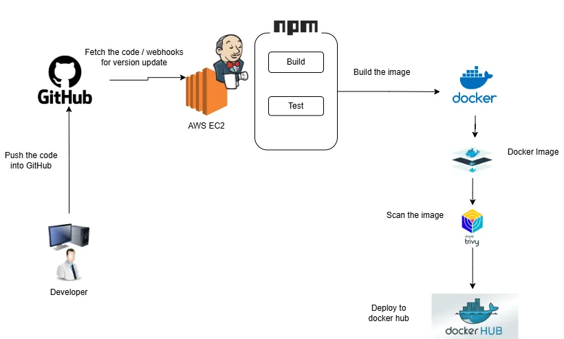
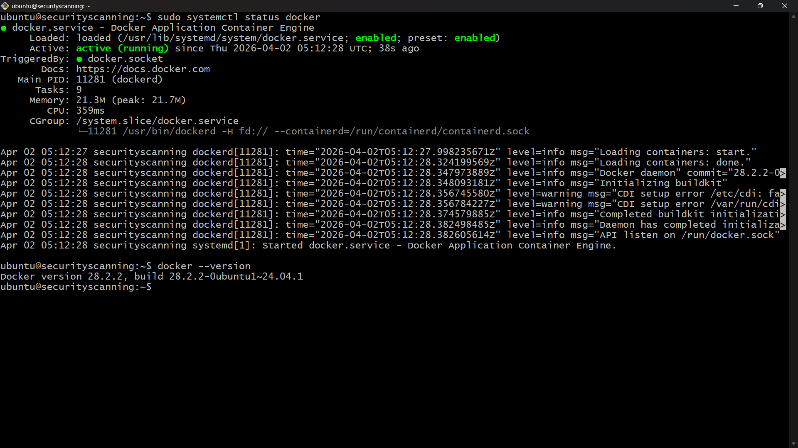
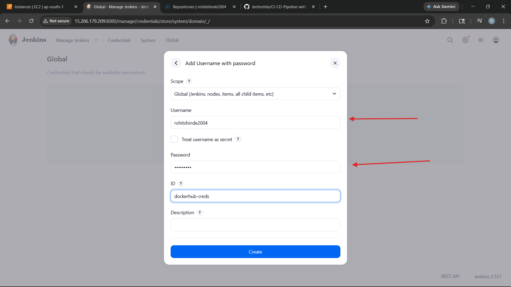
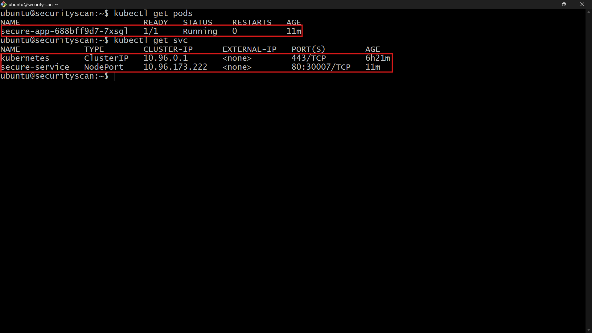

#  CI/CD Pipeline with Automated Docker Security Scanning & Kubernetes Deployment

---

## :pushpin: Project Overview

This project implements a **complete end-to-end CI/CD pipeline** using Jenkins, Docker, Trivy, and Kubernetes on AWS EC2.

The system automates:

* Code integration from GitHub
* Docker image build
* Security scanning using Trivy
* Push image to Docker Hub
* Deployment to Kubernetes cluster

 This eliminates manual deployment and ensures **secure, automated delivery pipeline**.

---

##  Architecture



---

### Components

1. **Jenkins Server** – CI/CD automation
2. **GitHub Repository** – Source code
3. **Docker** – Containerization
4. **Trivy** – Security scanning tool
5. **Docker Hub** – Image registry
6. **Kubernetes (Minikube)** – Deployment platform

---

### CI/CD Pipeline Flow

```
GitHub → Jenkins → Docker Build → Trivy Scan → Docker Hub → Kubernetes Deployment
```

---

## :dart: Project Objective

As a DevOps Engineer, the objective is to:

* Automate build and deployment process
* Integrate security scanning in CI/CD pipeline
* Deploy containerized applications to Kubernetes
* Reduce manual effort and increase reliability

---

## Prerequisites

* AWS Account (EC2 access)
* GitHub Account
* Docker Hub Account
* Basic Linux knowledge
* SSH Key Pair

---

##  EC2 Infrastructure Setup

### 🔹 Jenkins + Kubernetes Server

| Parameter     | Value                 |
| ------------- | --------------------- |
| Instance Name | DevOps-Server         |
| AMI           | Ubuntu 22.04          |
| Instance Type | t2.medium             |
| Storage       | 20 GB                 |
| Ports         | 22, 8080, 30000-32767 |

 Why t2.medium?

* Jenkins + Docker + Kubernetes require higher RAM

---

## :chart_with_upwards_trend: Increase EBS Volume Size

### Step 1: Modify Volume in AWS

* Go to EC2 → Volumes
* Select Volume → Modify Volume
* Increase:

  * 8GB ➝ 20GB

---

### Step 2: Expand Disk in EC2

```bash
lsblk
sudo growpart /dev/xvda 1
sudo resize2fs /dev/xvda1
```

---

## :rocket: Deployment Steps

---

## Step 1: Install Jenkins

```bash
sudo apt update -y
sudo apt install openjdk-17-jdk -y

wget -q -O - https://pkg.jenkins.io/debian-stable/jenkins.io.key | sudo apt-key add -

sudo sh -c 'echo deb https://pkg.jenkins.io/debian-stable binary/ > /etc/apt/sources.list.d/jenkins.list'

sudo apt update
sudo apt install jenkins -y

sudo systemctl start jenkins
sudo systemctl enable jenkins
```

---

##  Access Jenkins

```bash
sudo cat /var/lib/jenkins/secrets/initialAdminPassword
```

 Open:

```
http://<EC2-PUBLIC-IP>:8080
```

---

##  Install Jenkins Plugins

* Pipeline
* Git
* Docker Pipeline
* Credentials Binding
* Kubernetes CLI
* Blue Ocean

---

## Step 2: Install Docker

```bash
sudo apt install docker.io -y
sudo systemctl start docker
sudo systemctl enable docker

sudo usermod -aG docker ubuntu
sudo usermod -aG docker jenkins
```
---


##  Add DockerHub Credentials

* Go to: Manage Jenkins → Credentials
* Kind: Username & Password
* ID: `dockerhub-creds`

---



## Step 3: Install Trivy

```bash
sudo apt install wget apt-transport-https gnupg -y

wget -qO - https://aquasecurity.github.io/trivy-repo/deb/public.key | sudo apt-key add -

echo deb https://aquasecurity.github.io/trivy-repo/deb stable main | sudo tee /etc/apt/sources.list.d/trivy.list

sudo apt update
sudo apt install trivy -y
```

---

## Step 4: Install Kubernetes (Minikube)

```bash
curl -LO https://storage.googleapis.com/minikube/releases/latest/minikube-linux-amd64

sudo install minikube-linux-amd64 /usr/local/bin/minikube

minikube start --driver=docker
```

---

## Verify Kubernetes

```bash
kubectl get nodes
```

---

## Step 5: Connect Jenkins with Kubernetes

### 🔹 Copy kubeconfig

```bash
sudo mkdir -p /var/lib/jenkins/.kube
sudo cp ~/.kube/config /var/lib/jenkins/.kube/config
sudo chown -R jenkins:jenkins /var/lib/jenkins/.kube
```

---

### 🔹 Fix Permission

```bash
sudo chmod -R 755 /home/ubuntu/.minikube
```

---

### 🔹 Set Environment Variable

```bash
sudo vim /etc/default/jenkins
```

Add:

```bash
KUBECONFIG=/var/lib/jenkins/.kube/config
```

---

### 🔹 Restart Jenkins

```bash
sudo systemctl daemon-reexec
sudo systemctl restart jenkins
```

---

### 🔹 Test Connection

```bash
sudo -u jenkins kubectl get nodes
```
---



## Step 6: Jenkins Pipeline


```groovy
pipeline {
    agent any

    environment {
        IMAGE_NAME = "your-dockerhub-username/app"
    }

    stages {

        stage('Checkout') {
            steps {
                git 'https://github.com/techrohitx/CI-CD-Pipeline-with-Automated-Docker-Security-Scanning-and-Deployment-to-Kubernetes.git'
            }
        }

        stage('Build') {
            steps {
                sh 'docker build -t $IMAGE_NAME .'
            }
        }

        stage('Scan') {
            steps {
                sh 'trivy image $IMAGE_NAME'
            }
        }

        stage('Push') {
            steps {
                withCredentials([usernamePassword(credentialsId: 'dockerhub-creds', usernameVariable: 'USER', passwordVariable: 'PASS')]) {
                    sh '''
                    echo $PASS | docker login -u $USER --password-stdin
                    docker push $IMAGE_NAME
                    '''
                }
            }
        }

        stage('Deploy') {
            steps {
                sh 'kubectl apply -f k8s/'
            }
        }
    }
}
``` 
---

---

## Step 7: Create Jenkins Pipeline Project

1. Open Jenkins Dashboard  
    http://<EC2-PUBLIC-IP>:8080  

2. Click on **New Item**

3. Enter:
   - Name: `secure-devops-pipeline`
   - Select: **Pipeline**
   - Click OK

---

##  Step 8: Configure Pipeline

1. Scroll to **Pipeline Section**
2. Select:
   - Definition → **Pipeline script from SCM**
   - SCM → Git
   - Repository URL → your GitHub repo

3. Save the configuration


---

## Step 9: Build Pipeline

1. Click **Build Now**
2. Go to **Build History**
3. Click latest build → Console Output

 Screenshot:


---

##  Step 10: Verify Pipeline Success

Check stages:
- ✔ Clone Code
- ✔ Build Docker Image
- ✔ Trivy Scan
- ✔ Push Image
- ✔ Deploy to Kubernetes

 Screenshot:


---

##   Verify Docker Image in Docker Hub

1. Go to Docker Hub  
2. Open your repository  
3. Verify pushed image

 Screenshot:


---

##  Verify Deployment in Kubernetes

```bash
kubectl get pods
kubectl get svc
```

---

##  Access Application

```bash
kubectl get svc
```


 Open:

```
http://<NODE-IP>:<PORT>
```

---

##  Project Structure

```
.
├── k8s/
│   ├── deployment.yaml
│   ├── service.yaml
├── Dockerfile
├── app.py
└── Jenkinsfile
```

---

## Final Output

* CI/CD Pipeline Working
* Docker Image Built
* Security Scan Completed
* Kubernetes Deployment Successful

---

## Key Learnings

* CI/CD automation using Jenkins
* Container security scanning with Trivy
* Kubernetes deployment automation
* Infrastructure setup on AWS

---

## Security Considerations

* Used Docker credentials securely in Jenkins
* Avoided hardcoded secrets
* Integrated vulnerability scanning
* Controlled EC2 security groups

---

##  Project Outcome

Successfully built a **production-like DevOps pipeline** that:

* Automates deployment
* Ensures secure container images
* Deploys applications on Kubernetes
* Reduces manual intervention

### :red_circle: **Summary**

This project builds a complete CI/CD pipeline using Jenkins, Docker, and Kubernetes.
Source code is stored in GitHub and automatically triggered in Jenkins on changes.
Jenkins performs build and test stages, then creates a Docker image.
The Docker image is pushed to DockerHub for storage and versioning.
Kubernetes is used to deploy and manage the containerized application.
The pipeline ensures continuous integration and continuous deployment.
It reduces manual effort and improves deployment speed and reliability.
The system supports scalability and easy rollback of application versions.

---

